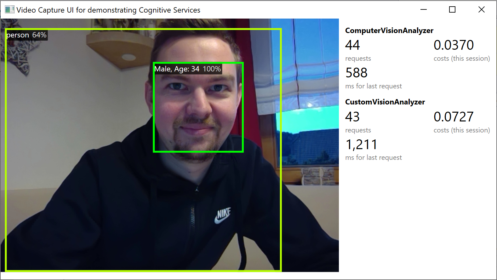

# Video Capture application to demonstrate Azure Cognitive Services

<p>
        
</p>

I regularly demonstrate how to use the [Microsoft Azure Cognitive Services](https://azure.microsoft.com/en-us/services/cognitive-services/) and tried to find a way how to send a webcam live stream directly to the Cognitive Services.

The [Cognitive-Samples-VideoFrameAnalysis](https://github.com/microsoft/Cognitive-Samples-VideoFrameAnalysis) project didn't fulfill all my requirements, especially I was looking for a .NET Core 3 WPF application with dependency injection and MVVM.

So.. here it is. Feel free to use it, any feedback (or pull request) is welcome!



## Usage
The main application uses the [OpenCvSharp](https://github.com/shimat/opencvsharp) wrapper to grab frames from the webcam. In a configurable frequency (see constructor of _MainViewModel_, default is 1 second) the frame is sent to _IImageAnalyzer_ implementations.

Currently two _IImageAnalyzers_ are available: _ComputerVision_ and _CustomVision_. 

.NET Core dependency injection is used to instantiate and configure them.

You can easily extend the application by creating your own _IImageAnalyzer_ implementations.

### App.xaml.cs
```cs
private void ConfigureServices(IServiceCollection services)
{
    services.AddSingleton<IVideoGrabber, VideoGrabber>();

    services.Configure<ComputerVisionSettings>(this.Configuration.GetSection(nameof(ComputerVisionSettings)));
    services.Configure<CustomVisionSettings>(this.Configuration.GetSection(nameof(CustomVisionSettings)));

    services.AddTransient<IImageAnalyzer, ComputerVisionAnalyzer>();
    services.AddTransient<IImageAnalyzer, CustomVisionAnalyzer>();

    services.AddScoped<MainViewModel>(
        sp => new MainViewModel(
            this.ServiceProvider.GetRequiredService<IVideoGrabber>(),
            TimeSpan.FromSeconds(1),
            this.ServiceProvider.GetServices<IImageAnalyzer>().ToArray()));
    services.AddTransient(typeof(MainWindow));
}
```

### appsettings.json
Please specify your endpoint and API key in the _appsettings.json_ file:

```json
{
  "ComputerVisionSettings": {
    "SubscriptionKey": "[Key]",
    "Endpoint": "https://westeurope.api.cognitive.microsoft.com/"
  },
  "CustomVisionSettings": {
    "PredictionKey": "[Key]",
    "ProjectId": "[GUID]",
    "Iteration": "[IterationName]",
    "Endpoint": "https://westeurope.api.cognitive.microsoft.com/",
    "RecognitionThreshold": 0.75
  }
}

```

## Statistics
To get an idea of the approximate costs, I've added statistics to the application. Every analyzer specifies the costs per request, the application calculates the total costs and additionally measures the request duration.

Please be aware of the fact that the prices in the repository are in Euro - and might be outdated. The current costs can be found here: [Cognitive Services pricing](https://azure.microsoft.com/en-us/pricing/details/cognitive-services/).
